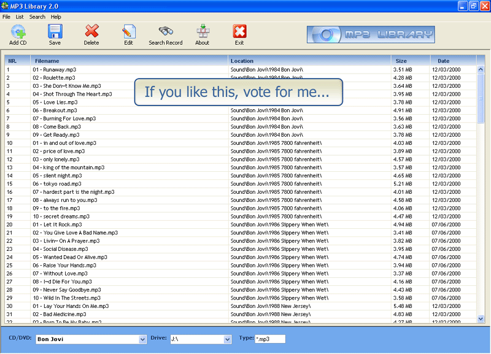



## MP3 Library 2\.0

### Description

This software scan CD drive for mp3, wav, ogg, wma etc. files to save in database. It's cool. Try...and vote for me if u like this...
 
### More Info
 

             |
---                |---
**Submitted On**   |2005-12-11 05:47:54
**By**             |[Visual Soft Computers](https://github.com/Planet-Source-Code/PSCIndex/blob/master/ByAuthor/visual-soft-computers.md)
**Level**          |Intermediate
**User Rating**    |4.0 (8 globes from 2 users)
**Compatibility**  |VB 6\.0
**Category**       |[Databases/ Data Access/ DAO/ ADO](https://github.com/Planet-Source-Code/PSCIndex/blob/master/ByCategory/databases-data-access-dao-ado__1-6.md)
**World**          |[Visual Basic](https://github.com/Planet-Source-Code/PSCIndex/blob/master/ByWorld/visual-basic.md)
**Archive File**   |[MP3\_Librar1990034272006\.zip](https://github.com/Planet-Source-Code/visual-soft-computers-mp3-library-2-0__1-65118/archive/master.zip)

